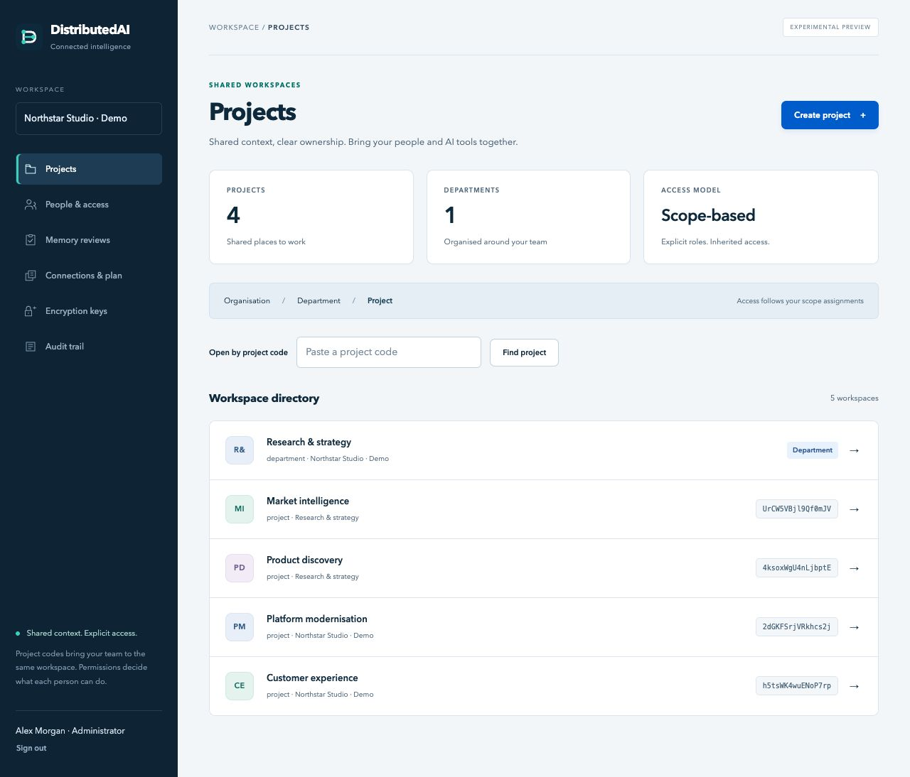
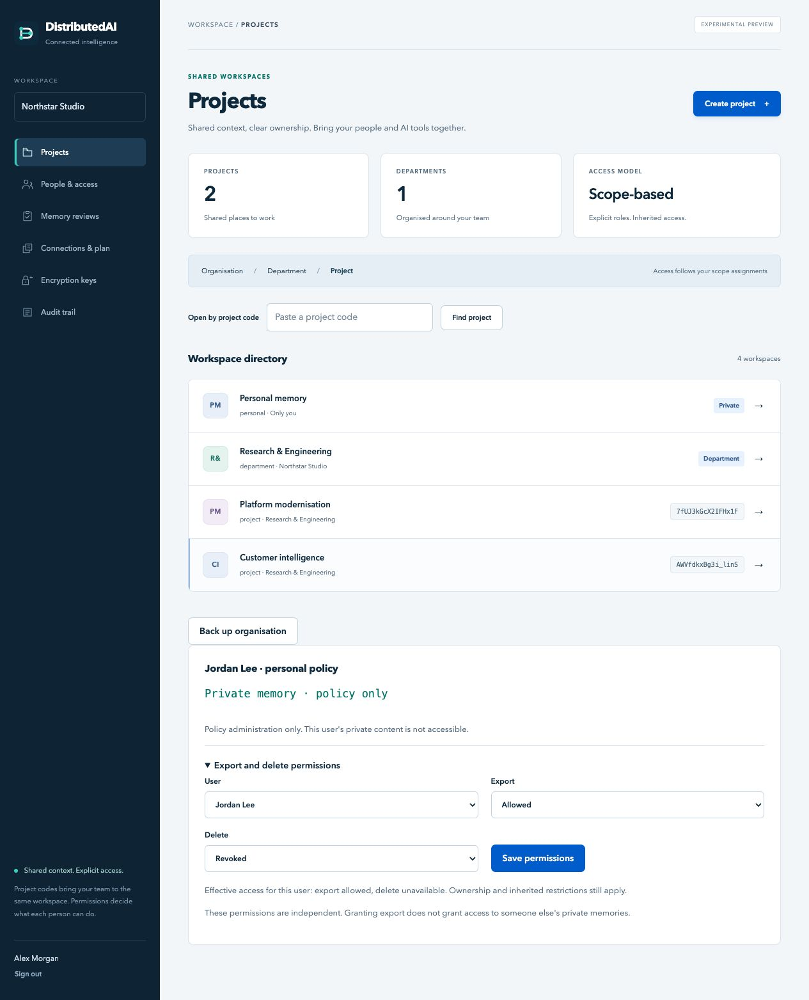

#  DistributedAI

> **Experimental — not fully tested. This solution may contain security vulnerabilities.**
> Automated tests and scans provide limited evidence, not a security assurance or production-readiness certification. Live cloud identity, payment-provider integration and deployment security require independent validation before use with sensitive data or production workloads.

Shared memory and coordination for people and AI tools, with explicit organisation and project access.



*Actual application screenshot · fictional demonstration data · experimental preview. [Explore the console](docs/CONSOLE.md).*

DistributedAI brings the proposal/review and leased-job patterns from Cognitive-Memory into an independent, portable service. Multiple Claude, ChatGPT, Codex, Hermes, OpenClaw, Perplexity, or other MCP clients can collaborate against one shared store. Each user or client instance has its own identity. A project code identifies the shared workspace; an administrator's access assignment authorises its use.

**Initial implementation, private repository.** Client compatibility depends on the client's MCP transport, authentication support, account plan and workspace policies. See [client setup](docs/CLIENTS.md) and [validation](docs/VALIDATION.md) for the distinction between tested behaviour and integration targets.

## Included

- Organisation → department → project scopes, inherited roles, immediate principal revocation, and project codes that never act as passwords.
- Browser console for project creation, users/client identities, access assignments, review queues and audit metadata.
- Contextual help, encrypted internal support tickets, organisation/solution support routing and configurable external portals. [Support guide and screenshots](docs/SUPPORT.md).
- Versioned memory proposals, independent review, optimistic version checks, provenance and immutable application-level history.
- Scoped private messages and jobs with atomic claims, expiring leases, fencing tokens, idempotency, cancellation and independent review.
- Deterministic injection screening and quarantine. Screening is deliberately not a guarantee: every retrieved payload remains untrusted data.
- Authenticated Streamable HTTP MCP, a stdio adapter, and optional OAuth resource-server support with signed JWT verification.
- Docker Compose installation with PostgreSQL, optional Caddy HTTPS, and an AWS Terraform starting point.

No embedding model, hosted LLM, Redis, broker, shell executor or paid API is required. Search is bounded lexical search. API replicas share PostgreSQL; this version does not synchronise independent databases or federate separate installations.

## Start locally

Install Docker Engine with Compose, or Docker Desktop. Python 3.9+ is sufficient for the setup script; the application runs as Python 3.12 in Docker.

```sh
git clone https://github.com/ShaunPrice/DistributedAI.git
cd DistributedAI
python3 scripts/setup.py
```

Setup creates unique local secret files, builds the application, starts PostgreSQL, initialises the schema and provisions the first organisation. It preserves existing secret files. Docker must already be installed; the script does not silently install a privileged daemon on your computer.

Open **[http://127.0.0.1:8090/manage/](http://127.0.0.1:8090/manage/)** and sign in with the token in `.secrets/bootstrap_token`. Treat that file as an organisation administrator credential. MCP is at `http://127.0.0.1:8090/mcp`.

1. Create a department or project in **Projects**.
2. In **People & access**, create a separate identity for each person or AI instance. Save the token when shown and deliver it through your own secure channel.
3. Assign that identity a role on the required project. Department and organisation grants also apply to descendants.
4. Share the project's code. Already-assigned collaborators can use it in the console or the MCP `project_resolve` tool.
5. Configure each AI client with its own token. Give ordinary clients writer or reader access; reserve review/admin authority for appropriate users.

Tokens are credentials; project codes are locators. Knowing a project code alone does not reveal its memory or grant access.

## Access model

| Role | Permissions in its scope and descendants |
|---|---|
| Reader | Read shared canonical memory and accessible jobs; receive addressed messages |
| Writer | Reader plus propose memory, send messages, create/claim/submit jobs |
| Reviewer | Writer plus independently review memory and jobs |
| Scope admin | Reviewer plus inspect scoped audit metadata |
| Organisation administrator | Manage projects, identities and grants within one organisation |

The offline database operator provisions additional organisations; tenant administrators cannot create or enter another organisation. Root/department grants are inherited. Removing a project grant does not remove access inherited from a parent. Use a separate identity for each independent reviewer; this enforces identity separation, not proof that two identities belong to different humans.

## Documentation

| Guide | What it covers |
| --- | --- |
| [Console tour](docs/CONSOLE.md) | Screenshots and workflows for workspace administrators |
| [Help and support](docs/SUPPORT.md) | Contextual guidance, support routing, internal tickets and your own AI client |
| [Architecture](docs/ARCHITECTURE.md) | Shared memory, coordination and security boundaries |
| [Client setup](docs/CLIENTS.md) | MCP connection examples and compatibility limits |
| [Deployment](docs/DEPLOYMENT.md) | Docker, HTTPS and AWS installation |
| [Serverless](docs/SERVERLESS.md) | AWS, Azure and GCP templates; cloud deployment unverified |
| [Identity](docs/IDENTITY.md) | Provider sign-in and passkey configuration; live integrations unverified |
| [Platform administration](docs/PLATFORM.md) | Separate account administration and content-access boundaries |
| [Encryption](docs/ENCRYPTION.md) | AES-256-GCM and customer-managed keys; cloud KMS integration unverified |
| [Accounts and billing](docs/BILLING.md) | Optional plans, quotas and payment adapters; live payments unverified |
| [Operating costs](docs/COSTS.md) | Indicative assumptions and estimates, not measured unit costs |
| [Import](docs/MIGRATION.md) | Scoped import from reviewed Cognitive-Memory exports |
| [Validation](docs/VALIDATION.md) | Test evidence, known gaps and limitations |
| [Access and ownership](docs/ACCESS_CONTROL.md) | Personal privacy, department administration, lifecycle and export/delete permissions |
| [Backup and recovery](docs/BACKUP_RECOVERY.md) | Encrypted database backup, scoped archives and recovery requirements |
| [High availability](docs/HIGH_AVAILABILITY.md) | Optional application replicas and managed database topology |
| [Layer separation](docs/LAYERS.md) | Code boundaries and independent web, application and database containers |
| [Security baseline](docs/SECURITY_REVIEW.md) | Implemented controls, regression evidence and deployment responsibilities |
| [Security](SECURITY.md) | Reporting and repository scanning |

Internet access requires a domain, HTTPS and a configured authentication path. Cloud templates create chargeable resources only when an operator applies them. Local setup does not deploy to a cloud.

## Develop and test

```sh
uv sync --frozen
uv run pytest -q
uv run ruff check distributedai tests scripts
python3 scripts/setup.py --generate-only
docker compose -f compose.yaml -f compose.test.yaml build test
docker compose -f compose.yaml -f compose.test.yaml run --rm test
terraform -chdir=infra/aws init -backend=false
terraform -chdir=infra/aws validate
```

The Docker test command includes real PostgreSQL concurrency tests in disposable schemas. Unit tests alone do not establish distributed correctness. Runtime dependencies are locked in `uv.lock`; production containers run without root privileges, Docker socket mounts or host workspace mounts.

This repository contains new service code and synthetic tests. It does not contain an export of personal Cognitive-Memory records, credentials, client configurations or prior conversation history.

## Personal memory and permissions

Each identity has private memory alongside its assigned projects. Administrators manage independent export and delete permissions without reading another user’s personal content.



## Licensing

The server under `distributedai/` (including its management UI) is licensed **AGPL-3.0-only**, except the standalone `distributedai/proxy.py` client adapter, which is **Apache-2.0**. The remaining original repository material—deployment templates, scripts, tests and documentation—is Apache-2.0. Third-party components retain their own licences. See [licensing boundaries](docs/LICENSING.md), [dependency audit](docs/DEPENDENCY_LICENSES.md), [server licence](LICENSE) and [Apache licence](LICENSE-APACHE-2.0).

Hosted modified server deployments must provide their interacting users access to the corresponding source under AGPL. The repository is currently private; a public deployment must separately arrange source access or make the appropriate source public. Changing a future release's licence does not revoke earlier grants.
