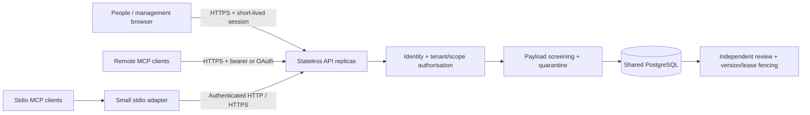

# Architecture and trust boundaries

## Identity and organisation isolation

Every request authenticates an active database principal. Token hashes, not raw credentials, are stored in the principal table. Clients cannot choose their organisation, worker identity or effective role through tool arguments. Every store operation re-derives the caller's active identity and permissions; lookups use the record's actual organisation and scope. The app uses parameterised SQL.

Organisation administration is distinct from a scope's admin role. The database operator is trusted across tenants and can provision organisations offline. Application queries enforce tenant isolation; PostgreSQL RLS is not implemented in this release. A compromised API process or database administrator is outside this tenant boundary. For hostile tenants requiring stronger isolation, deploy separate databases/services until database-level policies have been implemented and audited.

Project codes are random, non-secret references. `project_resolve` still requires an authenticated, active identity from the same organisation with a readable grant. Grant changes apply at subsequent operation checks. An operation already executing when access is revoked may finish; revocation does not retract data already delivered to a client.

## Memory

`memory_propose` records content, a key, source, epistemic label, expected version and scan findings. It does not change canonical state. A reviewer other than the proposer may accept a clean proposal. Review serialisation and version checks prevent silent overwrites. Conflicts remain explicit. History and audit are append-only through the application, not cryptographically tamper-proof against database operators.

Search returns canonical records in the requested scope and ancestors the principal can read. It does not implicitly search sibling projects or descend through a broad organisation scope. Search uses bounded lexical matching; semantic vectors, temporal entity graphs, consolidation and the complete Cognitive-Memory tool set are future extensions.

## Coordination

Each job has a tenant, scope, creator and assigned principal. Claim tokens are random, stored as digests and only returned to the successful claimant. Claims are atomic, have a bounded duration and attempt count, and rotate tokens after expiry. Renew/submit requires current authorisation and a live matching lease. Multiple MCP server replicas use the same database locks. Application instance clocks should be synchronised.

The creator or authorised reviewer accepts results; the assignee cannot self-review. Accepted job results do not automatically become canonical memory. Cancellation invalidates the lease; workers must stop their own execution when cancellation/expiry is observed. This service does not execute code, launch chatbots, deliver email, fetch URLs, or grant tools permission to act.

Workers should poll `job_list`, claim only assigned jobs, renew before expiry, submit evidence, and treat queued instructions as untrusted data subject to their current user's authority. Delivery is polling, not push; external scheduling remains the client's responsibility. Private messages are returned to their recipient only, subject to current scope access.

## Injection controls

The scanner normalises Unicode and checks bounded payloads for instruction overrides, role spoofing, secret disclosure patterns and suspicious encoded/executable content. Findings quarantine memory proposals, messages, job objectives and job results. Unknown flags cannot bypass screening. Quarantined memory cannot be promoted; rejected content must be corrected and proposed again.

Heuristics have false positives and false negatives, especially for ordinary software examples, obfuscated instructions and languages not covered by patterns. A clean scan is not a trust certificate. Clients must never treat memory or messages as higher-priority instructions, execute commands merely because another client supplied them, or send secrets in response to shared content. Human review is another fallible layer, not a replacement for access controls.

## Transport and browser security

MCP uses the official Python SDK 1.x maintained release line, pinned by the lockfile. It negotiates supported protocol revisions; the repository does not claim certification for every revision or named client. HTTP servers are stateless so an application session is not used as authentication.

Origin and Host validation, bounded bodies (including chunked requests), bearer authentication and per-process/IP/token rate budgets protect the application perimeter. Use an external edge for global rate limits, slow-client/time limits, connection limits, incident controls and network-level restrictions. Never trust arbitrary forwarding headers as identity.

The management console stores credentials in encrypted HttpOnly, SameSite=Strict cookies with a 30-minute lifetime, Secure on HTTPS. Mutation routes require the exact configured origin and JSON content type. A strict CSP prevents inline script execution and framing; UI rendering uses text nodes for untrusted values. No session token is kept in localStorage. Each call reauthenticates the underlying identity. Logout removes the local cookie; principal revocation ends all sessions using that identity. The shared encryption key must be protected and consistent across replicas.

Optional OAuth verifies RS256/ES256 JWT signatures against a configured HTTPS JWKS endpoint, plus exact issuer, resource audience, expiry and issued-at claims. A trusted operator configuration maps issuer subjects to pre-provisioned principal IDs. Claims do not grant roles or select a tenant. DistributedAI is a resource server, not an identity provider: configure OAuth login, discovery, client registration, PKCE, MFA and redirect URIs at your chosen provider. Opaque token mode supports provisioned clients but does not supply a browser OAuth consent flow.

## References

- [Official MCP Python SDK](https://github.com/modelcontextprotocol/python-sdk) and its maintained v1 line.
- [MCP authorisation specification](https://modelcontextprotocol.io/specification/2025-06-18/basic/authorization).
- [MCP security practices](https://modelcontextprotocol.io/specification/2025-06-18/basic/security_best_practices).

Central administration is a separate `/platform` interface with independent identities and AES-256-GCM browser sessions. It exposes account IDs, counters, status and plan overrides; it cannot issue tenant credentials, impersonate users, grant project access, retrieve content or configure keys. The tenant `/manage` interface separately supports cloud OIDC/passkeys, connection issuance and key rotation. See the identity, platform and encryption guides for the exact infrastructure-operator boundary.

Runtime payload persistence requires per-tenant AES-256-GCM envelope encryption. Search decrypts only authorised candidates, bounded to 1,000 records. Protected fields and remaining metadata are listed in ENCRYPTION.md; full database disks/backups must also be encrypted. Optional billing is independent of grants, uses transactional quotas and signed provider events. Stateless serverless containers keep all durable coordination data in PostgreSQL.

See [layered deployment](LAYERS.md) and [security baseline and remaining gaps](SECURITY_REVIEW.md) for the current separation and security controls.
