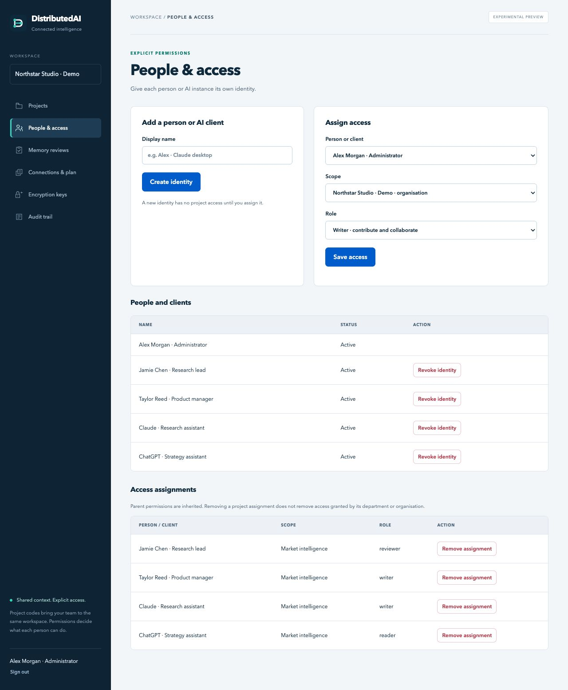
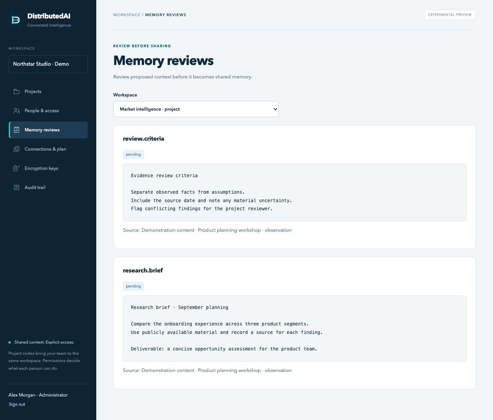
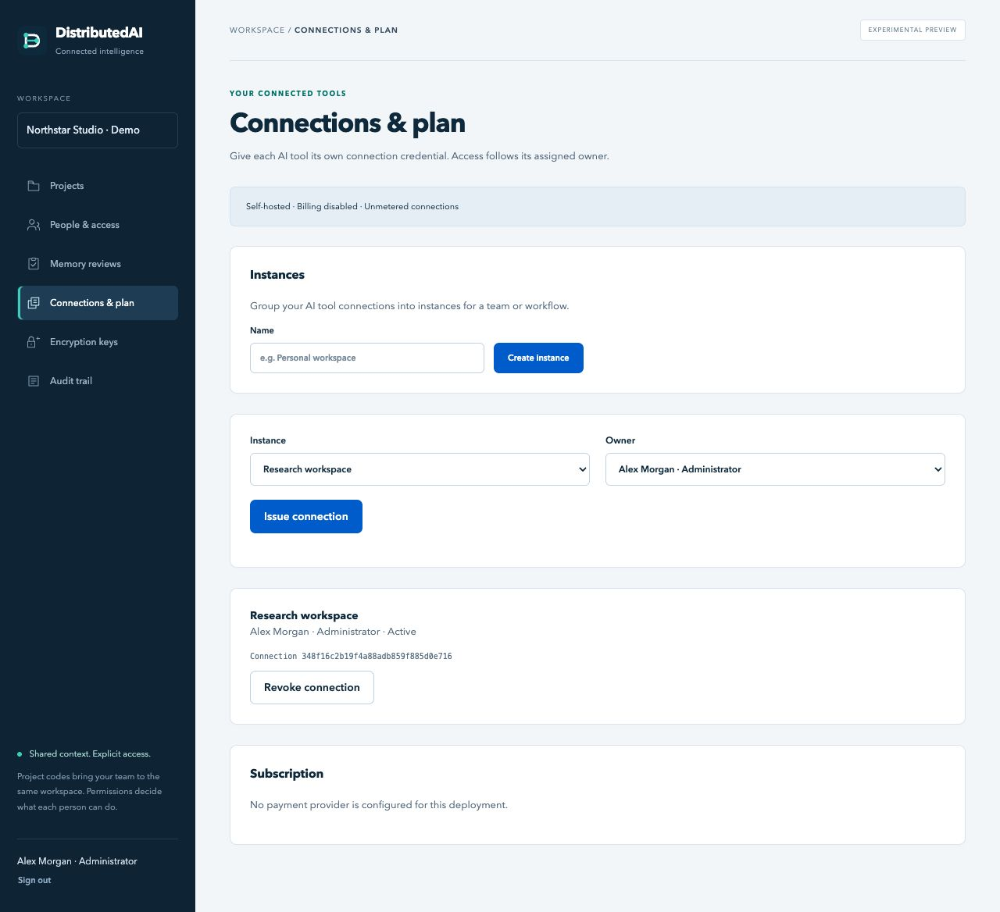
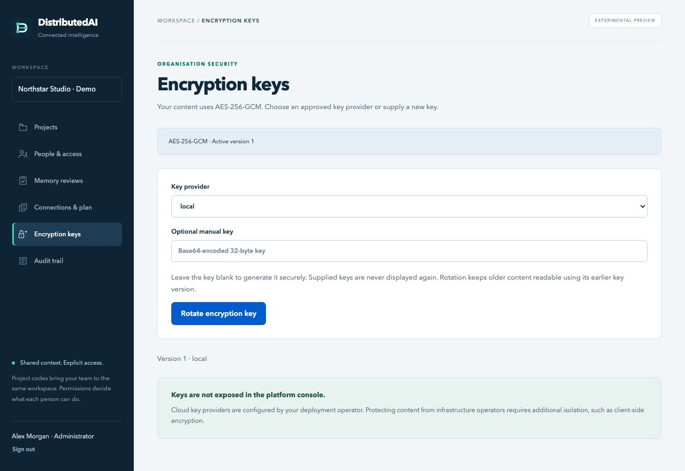
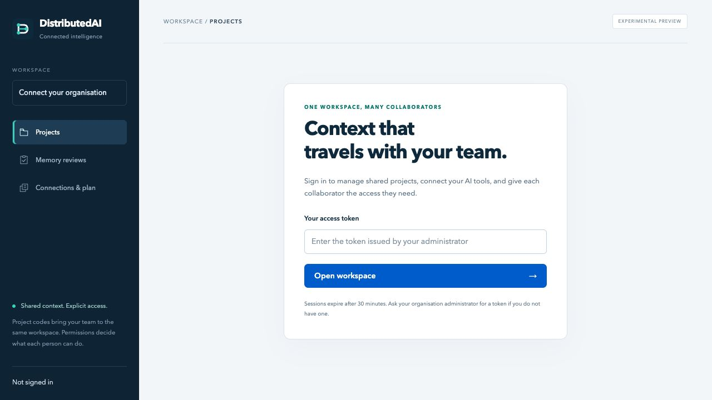
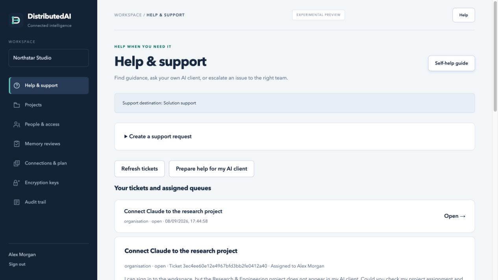
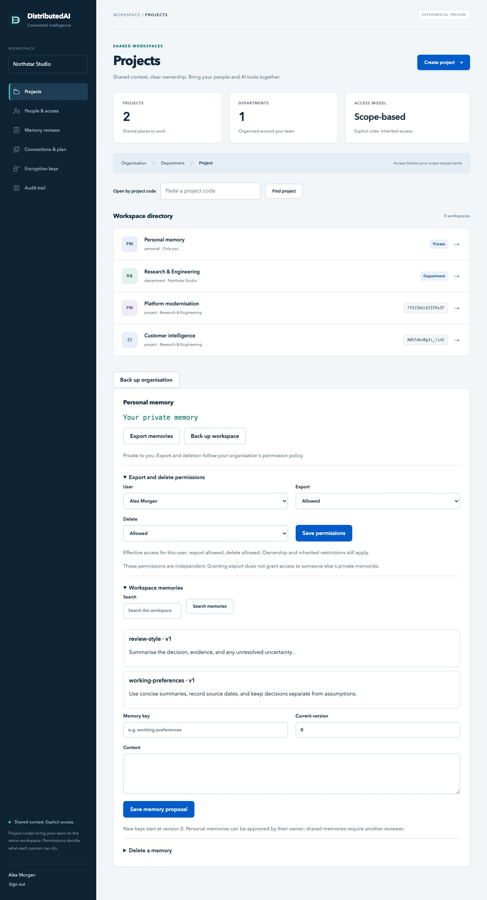

<!-- SPDX-License-Identifier: Apache-2.0 -->
# The DistributedAI console

Manage shared projects, people, AI connections and review workflows from one organisation workspace. Platform administration uses a separate console and credential.

**Experimental preview.** These are unaltered screenshots of the running application, captured on 8 September 2026 for the interface redesign following v0.1.0 commit `706d195`. All names, projects, account identifiers and records belong to an isolated fictional demonstration installation. No customer content or credentials appear. Screenshots illustrate the interface; they do not establish production readiness or live cloud/payment compatibility.

[Projects](#projects) · [People and access](#people-and-access) · [Memory reviews](#memory-reviews) · [Connections](#connections-and-plan) · [Encryption](#encryption-keys) · [Platform](#platform-administration)

## Projects

The overview shows the projects and departments visible to the signed-in identity. Select a workspace to retrieve its project code. A code locates the project; access still requires an assignment.

## People and access

Create distinct identities, then assign a scope and role. Department and organisation assignments apply to descendants. Removing a project assignment does not remove inherited access.

## Memory reviews

Select a workspace to inspect proposed context and its source. Shared-workspace proposals require an independent authorised reviewer. Personal owners may approve their own personal proposals, subject to screening. The screenshot shows the proposing administrator's view, so acceptance controls are absent.

## Connections and plan

Group connections by instance and assign each to an owner. The owner’s project permissions determine access. This demonstration runs with billing disabled; payment controls are not shown because no provider is configured.

## Encryption keys

Inspect the active key version and choose an approved provider when rotating keys. Keys are not exported through the platform console. Stronger protection against infrastructure operators requires additional deployment or client-side isolation; see the [encryption guide](ENCRYPTION.md).

## Platform administration

The separate platform console exposes account identifiers and aggregate metadata. It does not display organisation names, project content, credentials or key material. The [platform guide](PLATFORM.md) explains the precise boundary.

## Sign-in

Use a credential issued by your administrator, or the organisation identity provider when configured. Provider-managed passkeys depend on that provider and deployment configuration.

## Help and support

Select **Help** on the current page for contextual guidance, then **Escalate issue to support** if needed. **Help & support** shows the configured destination and the tickets your identity is authorised to read. Ordinary users are routed to organisation support; organisation administrators are routed to solution support. External portals open separately and require their own submission.

Internal tickets share only the text you review and submit. Assigned support staff can reply and route work without receiving memory or project access. **Prepare help for my AI client** produces a reviewed brief for your own MCP-capable client; DistributedAI does not run a support LLM or send the brief automatically. See the [support guide](SUPPORT.md) for configuration, permissions and limits.

## Screenshot maintenance

Capture a fresh set after material interface changes. Use a separate local database with synthetic data, the browser's normal desktop viewport, and full-page captures where needed. Never capture one-time credential panels, populated key fields, payment details or personal records. Inspect every image before committing it, preserve descriptive alt text, and keep the experimental status visible. SVG site and navigation icons are served locally; the interface does not depend on an external font or icon service.

## Personal memory and independent permissions

Select **Personal memory** in Projects to view or propose private context. Its owner can export memories, subject to export permission, and delete content subject to separate delete permission. Organisation administrators use **People & access → Personal memory policy** to manage those controls without browsing the user’s content. The following additional screenshots were captured from an isolated fictional installation during the 8 September access update.

Shared workspace details also include department moves, merges, ownership transfer and encrypted archives. See [access rules](ACCESS_CONTROL.md) and [backup and recovery](BACKUP_RECOVERY.md) for authority, deletion safeguards and archive limits.
