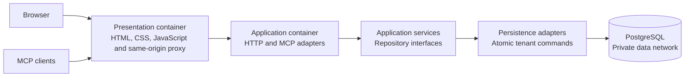

<!-- SPDX-License-Identifier: Apache-2.0 -->
# Layered architecture and separate deployment

DistributedAI separates browser/MCP presentation, application use cases and database access. A composition root constructs the dependencies. The default container remains convenient for local use; a separate presentation container is available for deployments that need independent frontend releases.



## Code boundaries

| Layer | Location | Responsibility |
| --- | --- | --- |
| Browser presentation | `distributedai/static/` | Local assets, accessible forms and same-origin API calls; no database credentials or SQL |
| HTTP/MCP presentation | `distributedai/presentation/` | Routing, authentication transport, cookies, CSRF, input/response conversion and request security |
| Application | `distributedai/application/` | Workspace, key, checkout and platform use cases; injected repository interfaces; no SQLAlchemy, database engine or HTTP server dependencies |
| Domain contracts | `distributedai/domain.py` | Identity and error types independent of transport/database |
| Persistence | `distributedai/persistence/` | SQL models, sessions, encrypted fields, key records, checkout storage, quota accounting and transactional commands |
| Composition | `distributedai/composition.py`, `runtime.py` | Configuration, concrete dependencies and lifecycle wiring |

Legacy top-level modules retain import compatibility for existing scripts and tests. New application and presentation code must not import those persistence compatibility modules. Architecture tests enforce these imports and prohibit SQL execution/engine access in both layers. A fake-repository test runs workspace use cases without a database.

Repositories execute **whole transactional commands**, not a sequence of unauthorised CRUD calls. Tenant revalidation, quotas, memory versions and job fencing stay inside the same database transaction as their writes. This deliberately preserves the existing concurrency guarantees. Replacing PostgreSQL requires a repository implementation that preserves those guarantees; it is not a driver-only substitution. Existing SQL tables and data remain compatible.

The API adapters and application services run together in the application process. The repository is an internal library, not an independently exposed database microservice. PostgreSQL is separately deployed. Do not expose a generic SQL or unauthorised CRUD service between layers.

## Run separate presentation, application and database containers

After running the normal installer, use Docker Compose 2.24.4 or newer:

```sh
docker compose -f compose.yaml -f compose.split.yaml up -d --build --wait web
```

The browser URL and MCP endpoint remain `http://127.0.0.1:8090/manage/` and `http://127.0.0.1:8090/mcp`.

- `web` contains only Caddy and static assets. It has no application/database secrets and cannot join the database network.
- `api` runs the HTTP/MCP adapters, application services and persistence adapters. `SERVE_ASSETS=false` disables its HTML/asset routes. Its host port is removed.
- `db` is attached only to the internal data network. Database ports are not published.
- The browser continues using one origin. Cookie paths and CSRF Origin checks remain intact; no permissive cross-origin policy is added.
- `web` uses a fixed private IP so the API trusts forwarded client identity from that proxy alone. It overwrites inbound `X-Forwarded-For`; untrusted callers cannot select their rate-limit identity. `APP_SUBNET` and `WEB_PROXY_IP` can be changed together if the defaults conflict with an existing network.

The web image builds independently:

```sh
docker build -f deploy/Dockerfile.web -t distributedai-web:0.1.0 .
```

Changing frontend assets does not require rebuilding the application image when using split deployment. API contracts and asset versions still need to be compatible.

## Internet and cloud deployment

The split example binds HTTP to loopback for local use. In production, put a managed HTTPS load balancer or TLS gateway in front of `web`, configure `PUBLIC_URL` to the public HTTPS MCP URL, and restrict backend access to that gateway. Supply `DATABASE_URL` through a secret manager and require verified TLS for a remote database. Restrict the database firewall/private network to application identities.

Do not combine the existing `compose.internet.yaml` with the split example unchanged: its edge currently targets `api`, which intentionally no longer serves browser assets. Point the TLS ingress at `web:8080` instead. Across multiple proxy hops, configure Caddy's trusted proxies and canonical client address explicitly; do not trust arbitrary forwarded headers. The local split example assumes `web` is the first trusted HTTP proxy.

Cloud Terraform examples currently deploy the application container; a separately deployed web image and cloud ingress require corresponding operator configuration. This refactor supplies a working local split, not a claim that a three-service topology has been provisioned on every cloud.

## Security verification

See [security review](SECURITY_REVIEW.md), [validation](VALIDATION.md) and [security policy](../SECURITY.md). Layer separation reduces accidental coupling; it does not replace tenant authorisation or a deployment-specific security assessment.
