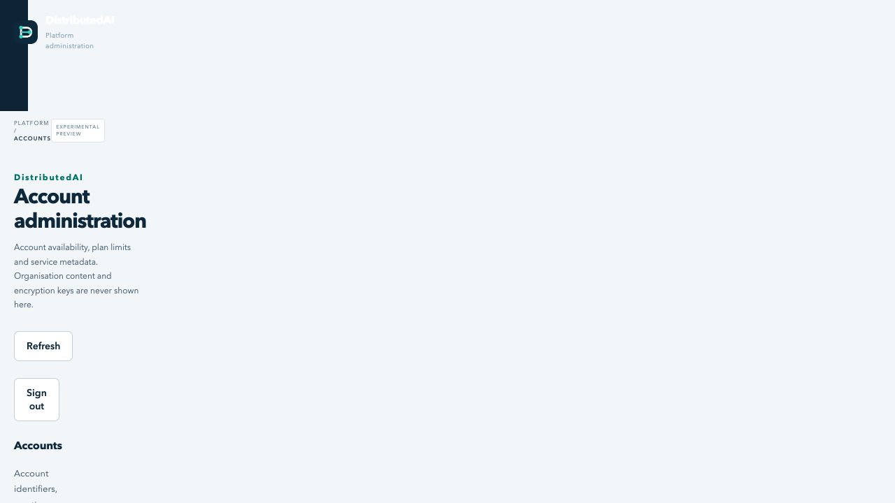

# Platform administration

*Experimental application preview with fictional demonstration data. [Console tour and capture notes](CONSOLE.md).*

The optional `/platform/` console is a separate application role from organisation administration at `/manage/`. It exposes only account IDs, creation dates, aggregate principal/scope counts, service availability, account suspension state and billing plan/status metadata. It does not return organisation or user names, memory, messages, jobs, project codes, tenant audit records, credentials or encryption keys.

Set `PLATFORM_ADMIN_TOKEN_FILE` to a separately generated secret of at least 48 characters and configure `MANAGEMENT_KEY_FILE`. Use a cryptographically random token, not a memorable password. Keep this credential separate from every tenant credential. Public instances require HTTPS. Prefer cloud sign-in with passkeys enforced by the provider policy. Set `LOGIN_MODE=oidc` and `PLATFORM_SUBJECTS_FILE` to a JSON array of explicitly authorised platform administrator subject IDs from the configured issuer. Register the additional redirect URI `https://YOUR-DOMAIN/platform/oidc/callback` on the same browser OAuth client. This role has its own subject allowlist; tenant subject mappings, tenant roles and email addresses never confer platform access. Cloud-only mode rejects the deployment-token login. In token or both mode, the separate strong platform credential is required. The console is disabled when neither a platform credential nor an eligible cloud subject configuration is supplied. A private network or identity-aware access proxy adds another useful boundary.

Platform sessions expire after 15 minutes. Sessions use AES-256-GCM with authenticated timestamps and random nonces. Their encryption key is derived with HKDF and a platform-specific purpose from the deployment management key. Legacy Fernet cookies are rejected after this upgrade; the existing 32-byte deployment key file remains compatible. Cookies are HttpOnly, SameSite Strict, Secure on HTTPS, and restricted to `/platform`. Management cookies and organisation tokens cannot authenticate this role. Rotating the platform credential and restarting all replicas invalidates prior token-authenticated platform sessions. Removing a subject from the configured platform allowlist invalidates its sessions when the updated configuration is loaded on all replicas. Provider-side revocation is bounded by the short local session lifetime. Never reuse the platform credential when provisioning a tenant principal.

Suspending an account denies its authentication and tenant operations without modifying project assignments. Resume restores the previous assignments. Suspension and resumption are recorded in a separate metadata audit table without a free-text field. This audit is operational evidence, not tamper-proof evidence against a database administrator. The list is bounded to the first 1,000 accounts and signals truncation; larger deployments need a paginated operational interface.

There are deliberately no impersonation, tenant credential reset, content search, key reveal, grant editing, arbitrary query or arbitrary tenant-operation routes. Organisation administrators retain project membership and content governance. Platform staff may explicitly assign one of the deployment-configured plans through `/platform/accounts/plan`. This changes entitlement limits immediately, records a separate metadata audit, and never edits project grants or tenant users. Billing must be enabled; the UI hides plan controls otherwise. This is a staff override, not a payment receipt, and later validated subscription events may change the plan again. Platform suspension remains a separate operational control. Neither a successful payment nor a platform session grants tenant content access.

## Security boundary

This console enforces application-level content blindness. It does not stop a person who controls the runtime, database or deployment key from bypassing application code. AES-256 encryption with keys available to the same server does not by itself remove that infrastructure trust. For stronger isolation, deployer options include client-side encryption with keys remaining outside the service, or confidential computing with attestation-gated key release. The platform console never accepts or returns encryption keys. See the encryption deployment documentation for supported modes and their limits.

## Integration contract

`PlatformService(engine).initialize()` creates the two small metadata tables. Initialise it under the same database schema initialisation lock as the main service. `is_active(org_id)` reads the current suspension status from the shared database, so each replica sees changes without an in-process cache. Call it for bearer authentication, cloud principal resolution and every tenant dispatch, denying suspended organisations before work. Mount `platform_app(service, settings)` only when the optional credential or cloud administrator allowlist is configured, behind the server's request-size, Host/Origin and rate controls. A global edge rate limit is still needed across replicas.

`tests/test_platform.py` covers signed cloud login, separate platform subjects and callback paths, rejection of tenant-only cloud identities, subject removal, cloud-only token rejection, tenant credential rejection, cookie domain separation, absent content/impersonation/key endpoints, metadata field allowlisting, mutation CSRF, strict suspension validation, shared-engine suspension visibility and the separate operational audit. Integration tests must also verify suspension terminates tenant access through both management and MCP transports.
