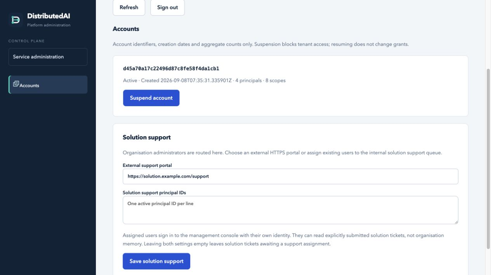

# Help and support

DistributedAI provides contextual help, an optional external support destination, and internal support tickets. Users can also prepare a reviewed support brief for their own AI client. The service does not run a support LLM, submit issues to third-party systems automatically, or send email notifications.

## Get help from any page

Select **Help** to open guidance for the current page. The topic selector covers sign-in, projects and personal memory, people and access, memory reviews, connections and plans, encryption, audit, support and platform administration. Help is locally authored guidance; it does not retrieve private memories or call an external service.

Choose **Escalate issue to support** when the guidance does not resolve the problem. Signed-in users are taken to **Help & support**, with the originating page recorded for an internal ticket. The destination shown there depends on the user's role and the configured support route.

If you cannot sign in, help remains available. Use your established organisation support channel, or the solution portal link when configured. Anonymous visitors cannot read tickets or submit internal tickets. Never send a sign-in token or encryption key to support.

## Who handles each issue

| Person requesting help | Configured external route | Internal route when no portal is configured |
| --- | --- | --- |
| Ordinary organisation user | The organisation's support portal, or its installation default | The organisation support queue. Assigned active support users handle it; active organisation administrators are the fallback when no active support team is available. |
| Organisation administrator | The solution support portal | The solution support queue, handled by explicitly assigned active solution support users. |
| Signed-out visitor or platform console user | The public solution portal link, when configured | Sign in with an ordinary user identity or use an established support channel; there is no anonymous internal submission. |

Organisation administrators can handle their organisation's ordinary support queue even when a support team is configured. Support handlers can assign tickets to eligible active handlers. New internal tickets initially appear unassigned in the appropriate queue; routing does not automatically select a particular person.

Solution support users sign in to the ordinary management console with their own identity. They may see solution tickets submitted by organisation administrators across organisations. This specific ticket-sharing role does not grant access to organisation memory, personal memory, projects, credentials or encryption keys. A platform administrator credential does not automatically become a ticket-reading identity.

If neither solution support users nor a solution portal is configured, organisation-administrator tickets remain in the internal solution queue awaiting a handler. Configure a destination before offering a supported public service.


## Configure support

### Installation defaults

The installer accepts optional HTTPS portal URLs:

```sh
python3 scripts/setup.py \
  --solution-support-url https://support.example.com/distributedai \
  --org-support-url https://helpdesk.example.com
```

Use the solution URL for organisation administrators and the organisation default for ordinary users. The installer validates the URLs and saves defaults in `.secrets/support_defaults.json`; it does not create an external helpdesk integration or send a test ticket.

To use internal solution support, first provision the support staff's normal identities. Then supply their existing principal IDs; repeat the option for multiple people:

```sh
python3 scripts/setup.py --generate-only \
  --solution-support-url '' \
  --solution-support-user EXISTING_PRINCIPAL_ID_ONE \
  --solution-support-user EXISTING_PRINCIPAL_ID_TWO
```

Omitted options preserve their previous defaults. Explicitly supplying a URL changes that default; an empty URL selects the internal route. Supplying support-user options replaces the default list with the supplied IDs. Recreate or redeploy application replicas after changing the defaults file so each process loads the new configuration. The installer does not create those support identities on your behalf.

### Organisation settings

An organisation administrator opens **Help & support → Organisation support settings**:

1. Enter an HTTPS support portal, or leave it empty for internal tickets.
2. Select existing active users in **Support users**. Use Command or Ctrl to select several.
3. Select **Save organisation support**.

Only users in that organisation can be assigned as its support team. Leaving the portal and support-user list empty selects the internal queue with organisation-administrator fallback. An explicit saved configuration overrides the installation default, including an intentionally empty portal.

### Solution settings

A platform administrator opens **Platform administration → Solution support**:

1. Enter an HTTPS portal or leave the field empty for internal support.
2. Enter existing active solution support principal IDs, one per line.
3. Select **Save solution support**.



Saved solution settings override installation defaults. Staff use their own management-console sign-in to handle tickets; they do not need the platform credential. Removing or revoking a support user removes that handler's eligibility. Reporters retain access to tickets they submitted while their own identity remains authorised.

External destinations must be absolute HTTPS URLs without embedded credentials or fragments. The portal opens separately. No description, ticket history, credentials or private memory is appended or submitted automatically; the user completes that provider's form under its own privacy and authentication rules. There is no provider API, webhook, email or status synchronisation with the external portal.

## Work with internal tickets

In **Help & support**, review the displayed destination, expand **Create a support request**, enter a subject and description, and confirm that you have reviewed the information being shared before selecting **Create support ticket**. Include the affected page, expected result, reproduction steps, time and a request ID when available. Avoid credentials, key material and private records that are not necessary to explain the problem.

Use **Refresh tickets** to check for replies. Open a ticket to reply or change its status to open or closed. Eligible support handlers can use **Assign to support user** to assign the ticket to an authorised handler. Assignment does not narrow visibility to that handler alone: the reporter and eligible queue handlers retain access. No email or push notification is sent.

Ticket subjects, descriptions, originating-page text and reply bodies are encrypted at rest using the organisation's AES-256-GCM content encryption. The database retains routing, actor, status and audit metadata separately. Encryption does not stop an authorised support handler from reading the submitted ticket, or exclude an infrastructure operator who controls the runtime and its available decryption keys.

Current bounded storage controls are:

| Limit | Scope |
| --- | --- |
| 100 open tickets | Per organisation, across its organisation and solution tickets |
| 1,000 total tickets | Per organisation, including closed tickets |
| 100 replies | Per ticket |
| 10 MiB logical ticket/reply payload | Per organisation; a separate support allowance |
| 8,000 characters | Each description or reply |
| 100 visible tickets | The newest accessible results; the interface indicates truncation |

Closing a ticket releases an open-ticket slot but does not delete its content or reduce total-ticket/storage usage. No automatic retention purge, attachment upload or bulk support export is implemented. Plan an operator-managed retention process before these fixed limits become operational constraints.

## Use your own AI client

Connect your AI client to this installation through MCP and ask it to call `support_help` for the relevant topic. The tool returns local help text, not a generated diagnosis. For an existing ticket, `support_ai_context` returns only support content that your identity is permitted to read; it does not attach memories or retrieve unrelated organisation data.

The browser's **Prepare help for my AI client** creates a visible brief. Review it before choosing **Copy reviewed brief**, then paste it into your chosen client. Copying does not submit the brief. Inference and any sharing with an AI provider happen through your own client/account, under that provider's policies and charges.

Support text and AI responses remain untrusted data. The brief tells the client not to treat ticket text as instructions, execute actions without permission, or request credentials and encryption keys. Human review is still required; this is not a guarantee against prompt injection.

| MCP tool | Purpose |
| --- | --- |
| `support_help` | Read/search local contextual guidance |
| `support_options` | Find the caller's configured support destination |
| `support_create` | Explicitly submit reviewed text to the internal queue, or return the external route |
| `support_list`, `support_get` | Read only authorised tickets |
| `support_reply` | Explicitly send a reviewed reply and optionally change status |
| `support_ai_context` | Prepare authorised ticket context for the caller's own AI client |

## Recovery and validation

A whole PostgreSQL backup includes the support configuration, encrypted ticket/reply tables and support audit records. Preserve the corresponding content keys separately for recovery. Existing scoped memory archives do not include support tickets or support configuration; see [backup and recovery](BACKUP_RECOVERY.md).

Implementation is separated into `application/support.py`, `persistence/support.py` and the browser/MCP adapters. Support coverage is maintained in `tests/test_support.py` and `tests/test_support_http.py`; installation defaults can also be provided through the setup flags above. Refer to [validation](VALIDATION.md) for the coordinating run's current results. External portal integration, notifications and hosted AI assistance are not claimed because they are not implemented.
